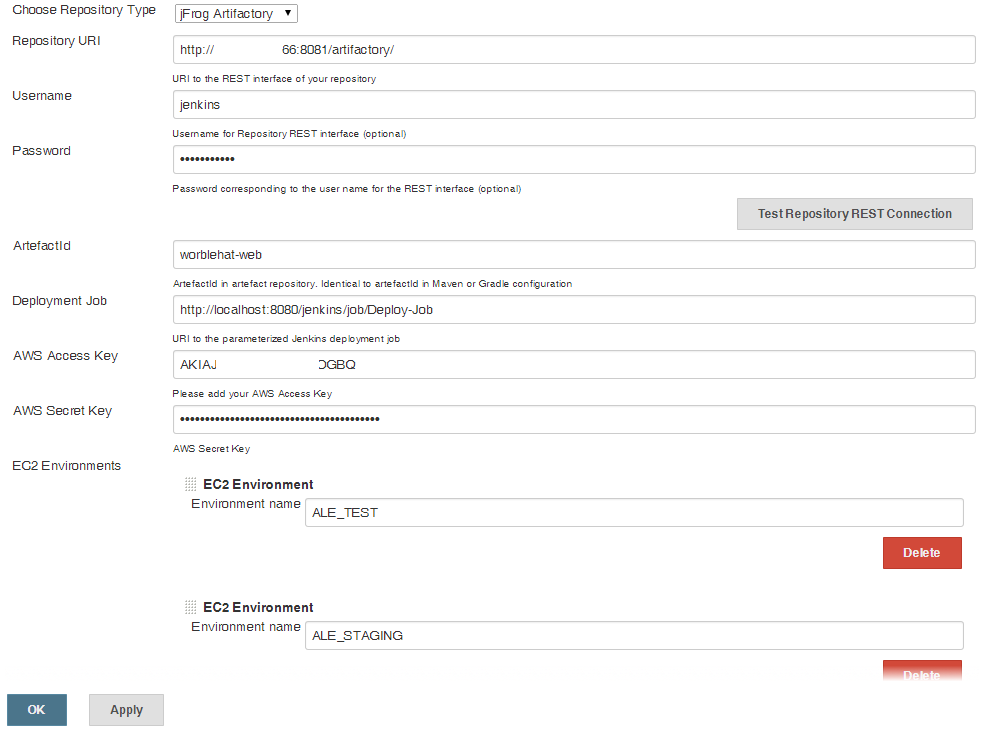

# Documentation

## Prerequisites

* Your are using Amazon EC2 instances for your servers?
* Your are using Artifactory or Nexus for storing your software artifacts?

Then you are all set to use this plugin :-)

## How to use the plugin

### Dashboard View

This Jenkins dashboard gives you an overview of all your EC2 instances that you configured. It shows the current state, the version deployed, uptime, instance type and the current IP. 
It also gets all artifact versions from your artifact repository. Currently we support jFrog Artifactory and Sonatype Nexus.

### Dashboard View Configuration

* configure your AWS credentials
* configure your repository (Artifactory or Nexus)
 

### Deployment Job Configuration

* create a parameterized deployJob (Parameter: ENVIRONMENT & VERSION)
* configure your AWS credentials
* within this job, configure your Deployment (via ShellScript/Batch/Puppet/Chef/ ...)

### AWS Details

AWS instances can be tagged with custom tags. This plugin uses tags to identify the specified environments and stores the deployed software version in that tag. Here is an example screenshot from the AWS Management Console.

