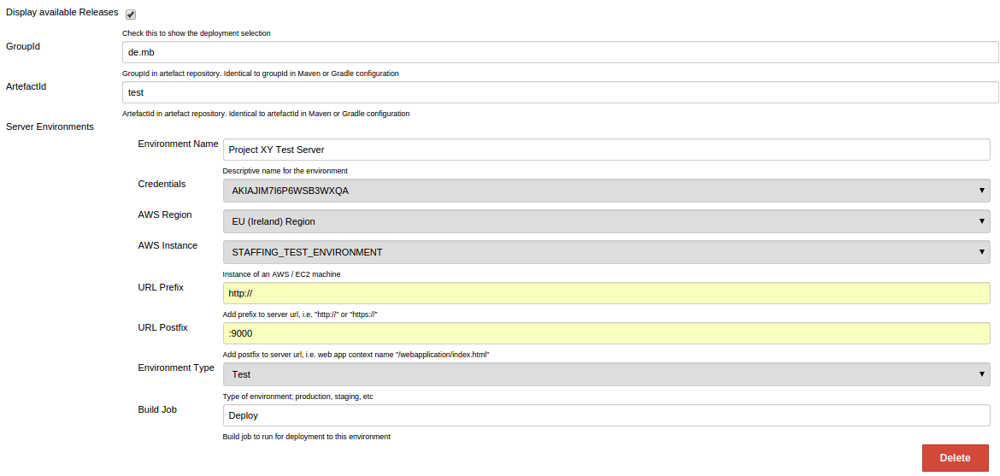
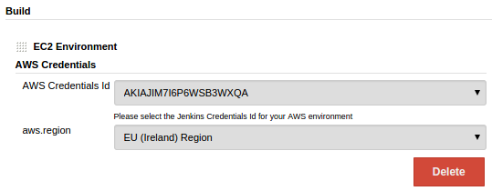
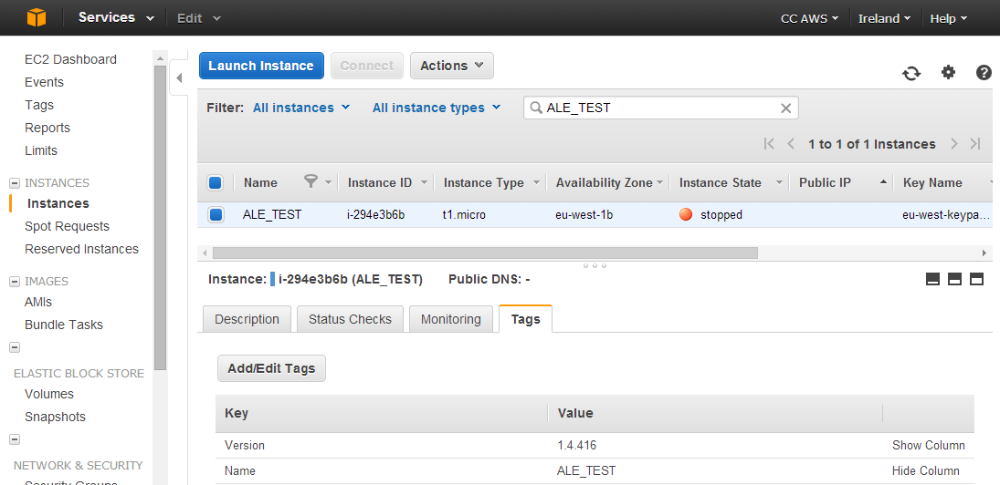

# Documentation

## Prerequisites

You need the following setup to use the plugin:

* Amazon EC2 instances for your deployment servers
* Artifactory or Nexus for storing your software artifacts

## Plugin Usage

Once the plugin is released under http://jenkins-ci.org you can use the packaged plugin.
For now you need to build it yourself.

* Check out the repository
* Run **mvn hpi:run**. This will start Jenkins with the plugin already installed and ready to use.
* Open jenkins http://localhost:8080/jenkins
 * Visit http://localhost:8080/jenkins/manage. From there go to
   * _Configure System_ to set your artifact parameters (there's a subregion called _Deployment Dashboard)
    * _Manage Credentials_ to set your AWS credentials
 * Create a new parameterized Job that we will use later for the deployment
  * Add a **Text Parameter** VERSION
  * Add a **Text Parameter** ENVIRONMENT
  * Add a **Build Step** and select **EC2 Environment** -> configure your AWS Credentials, see <a href="documentation/README.md">"How to create your AWS Credentials"</a>
 * Create a new View and select **Deployment Dashboard** under http://localhost:8080/jenkins/newView
 * Configure the View
  * Set the checkbox if you want to deploy artifacts using the dashboard view
  * Add **groupId** and **artifactId** of the artifact you want to deploy
  * Add your EC2 server environment you want to monitor and manage (in the dropdown list you should be able to find all available EC2 server)
  * For **Build Job** add the Job you configured previously
  * Save the configuration

Now you should be able to see the status of your EC2 instances, the versions tags and other details. On top of the dashboard you can select the available versions of the artifact and the environments you want to deploy to. When you click the **Deploy App** Button the deploy job will be triggered with two parameters:

* VERSION
* ENVIRONMENT

It is up to you now to take these parameters and pass them to your custom deployment scripts. On top the Deploy Job tags the environment with the version in 
order to update the deployment dashboard view.

## Screenshots

### Dashboard View

This Jenkins dashboard gives you an overview of all your EC2 instances that you configured. It displays the current state, the deployed artifact version, 
uptime, instance type and the current IP. 
It also gets all artifact versions from your artifact repository. Currently we support jFrog Artifactory and Sonatype Nexus.


### Dashboard View Configuration

* configure your AWS credentials
* configure your repository (Artifactory or Nexus)
 


### Deployment Job Configuration

* create a parameterized deployJob with the following parameter: ENVIRONMENT & VERSION
* configure your AWS credentials
* within this job, configure your Deployment (via ShellScript/Batch/Puppet/Chef/ ...)



## AWS Details

AWS instances can be tagged with custom tags. This plugin uses tags to identify the specified environments and stores the deployed software version in that tag. Here is an example screenshot from the AWS Management Console.



### AWS Credentials

Please follow these steps to configure the necessary AWS Credentials:

* Open https://console.aws.amazon.com/iam/home?#users
* Create new IAM User
* Attach User Policy -> Custom Policy -> Select -> Set Policy Name -> Paste Policy statement from below
 * allow User to create tags
 * allow User to delete tags
 * allow User to describe instances

Policy Statement: 

``` bash
{
  "Version": "2012-10-17",
  "Statement": [
    {
      "Sid": "Stmt1412928158000",
      "Effect": "Allow",
      "Action": [
        "ec2:DeleteTags",
        "ec2:DescribeInstances",
        "ec2:CreateTags"
      ],
      "Resource": [
        "*"
      ]
    }
  ]
}
```
